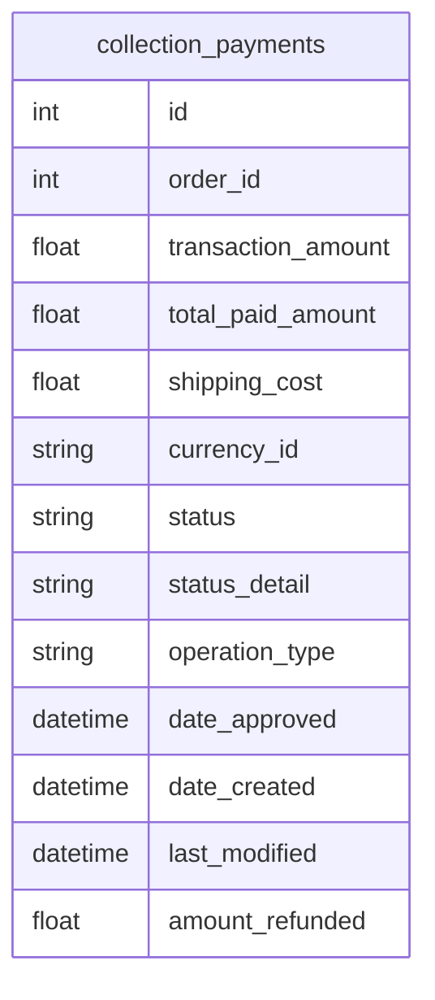

# 💳 Tech Challenge - Payment

Bem-vindo ao repositório do **Tech Challenge - Payment**! 🚀

Este serviço é responsável pelo processamento de pagamentos dentro da arquitetura do **Tech Challenge**, garantindo segurança, rapidez e confiabilidade nas transações financeiras. 💰

## 📌 Funcionalidades

✅ Processamento de pagamentos via diferentes métodos (cartão de crédito, PIX, boleto, etc.)  
✅ Validação e autenticação de transações  
✅ Integração com serviços financeiros externos  
✅ Registro e consulta de pagamentos  
✅ Suporte a estornos e cancelamentos  

## 🏗️ Arquitetura

O serviço de pagamento segue uma arquitetura baseada em microsserviços, utilizando **NestJS** para a API, **PostgreSQL** para persistência e integração com serviços externos para processamento de pagamentos.

## 🚀 Tecnologias Utilizadas

- **NestJS** - Framework para construção da API
- **TypeScript** - Tipagem estática para JavaScript
- **PostgreSQL** - Banco de dados relacional
- **Docker** - Containerização da aplicação
- **Jest** - Testes unitários e de integração
- **SQS** - Comunicação assíncrona entre serviços

## 📦 Como Executar o Projeto

### Pré-requisitos

- [Node.js](https://nodejs.org/) versão 16+
- [Docker](https://www.docker.com/)
- [PostgreSQL](https://www.postgresql.org/) instalado ou rodando em um container

### Rodando o projeto

1. Clone este repositório:
   ```sh
   git clone https://github.com/Grupo-26-FIAP/tech-challenge-payment.git
   ```
2. Acesse a pasta do projeto:
   ```sh
   cd tech-challenge-payment
   ```
3. Instale as dependências:
   ```sh
   npm install
   ```
4. Configure as variáveis de ambiente (crie um arquivo `.env` baseado no `.env.example`).
5. Execute a aplicação em modo de desenvolvimento:
   ```sh
   npm run start:dev
   ```

### Executando com Docker
```sh
  docker-compose up
```

## ✅ Testes
Para rodar os testes unitários e de cobertura:
```sh
npm run test:cov
```

## 📄 Documentação da API

A documentação da API pode ser acessada via Swagger após iniciar o projeto:
```
http://localhost:3003/api
```

### Diagrama do Banco de Dados

O diagrama abaixo ilustra a estrutura das tabelas e suas relações:



## 👥 Time de Desenvolvimento

| Nome                           | RM           | E-mail                                                             | GitHub                                             |
| ------------------------------ | ------------ | ------------------------------------------------------------------ | -------------------------------------------------- |
| Jhoni Farias                   | **RM357358** | [jhonifarias.developer@gmail.com](jhonifarias.developer@gmail.com) | [@JhoniFarias](https://github.com/JhoniFarias)     |
| Josef Henrique Zambreti        | **RM357836** | [josefhenrique@uol.com.br](josefhenrique@uol.com.br)               | [@Josefhz](https://github.com/Josefhz)             |
| Lucas Rodrigues Medina Costa   | **RM357360** | [lucasmedinarmc@gmail.com](lucasmedinarmc@gmail.com)               | [@diname](https://github.com/diname)               |
| Kleber de Oliveira Andrade     | **RM358012** | [pdjkleber@gmail.com](pdjkleber@gmail.com)                         | [@kleberandrade](https://github.com/kleberandrade) |
| Vitória Camila Xavier Sobrinho | **RM357235** | [vcamilaxs@gmail.com](vcamilaxs@gmail.com)                         | [@itsvickie](https://github.com/itsvickie)         |

## 🛠️ Contribuição

Quer contribuir? Siga os passos:
1. Faça um fork do repositório
2. Crie uma branch com a sua feature: `git checkout -b minha-feature`
3. Commit suas alterações: `git commit -m 'Adicionando nova feature'`
4. Envie para o repositório remoto: `git push origin minha-feature`
5. Abra um Pull Request 🚀

## 📢 Contato

Dúvidas ou sugestões? Entre em contato com a equipe do **Tech Challenge**! 😃

